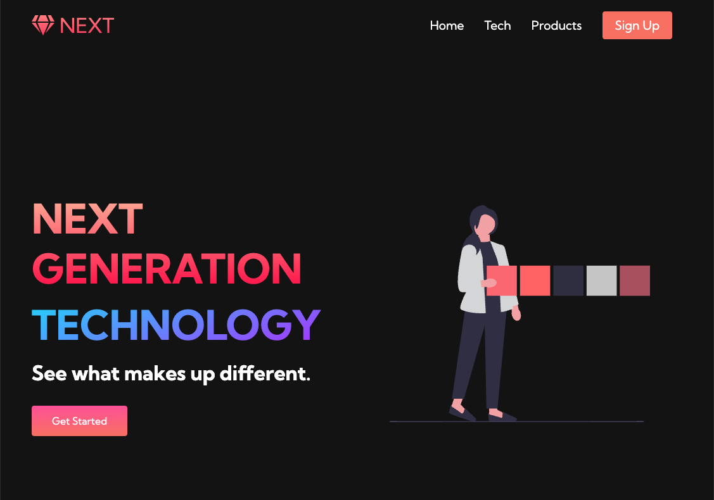
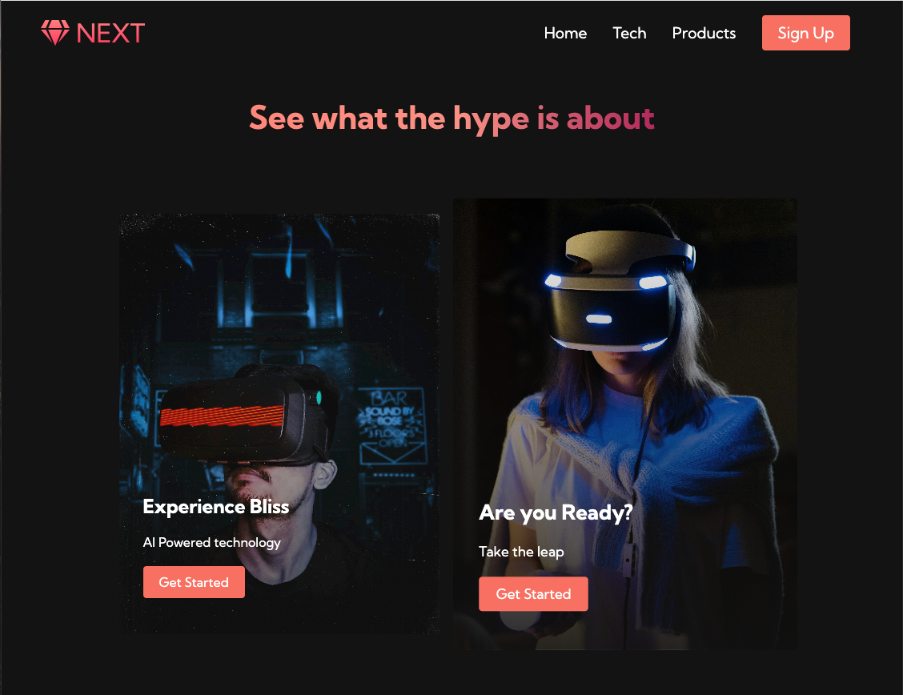
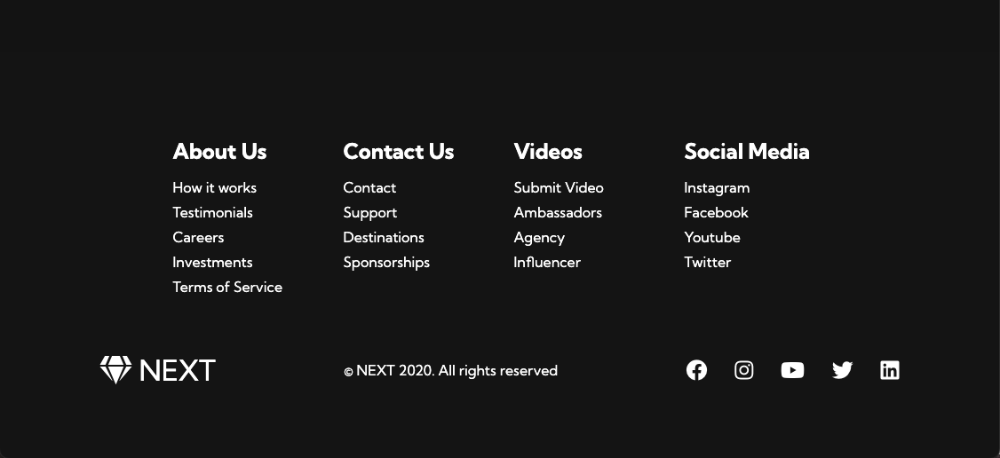
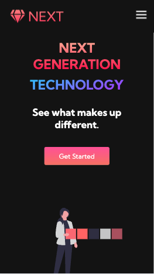

# Responsive-Website for VR-Sets Commercial

A modern, fully responsive website built for Commercial of a VR sets company using HTML, CSS (Flexbox & Grid), and JavaScript for dynamic content handling. The project demonstrates advanced front-end development techniques, including mobile-first design, CSS media queries for adaptive layouts, and JavaScript-driven interactivity. Features include optimized loading performance, smooth transitions, and a responsive grid system that ensures seamless user experience across all devices.

## Features
- Responsive design using Flexbox and CSS Grid
- Mobile-first approach with media queries
- Dynamic user interaction with vanilla JavaScript
- Optimized for different screen sizes and devices

## Screenshots

### Homepage



### Product Page


### Footer View


### Mobile View



## Technologies Used
- **HTML5**
- **CSS3 (Flexbox & Grid)**
- **JavaScript (ES6)**

## How to Run
1. Clone the repository:
   ```bash
   git clone https://github.com/SayaliBhosale16/Responsive-Website-Commercial-usecase.git
